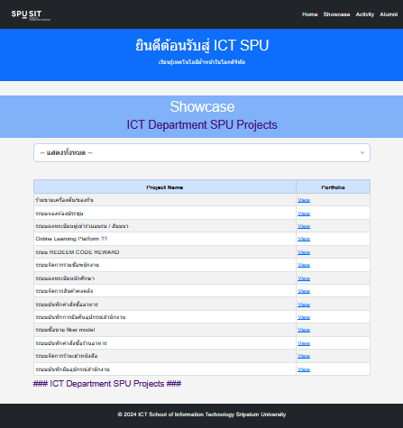
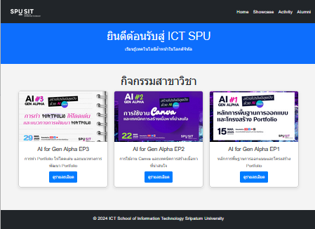
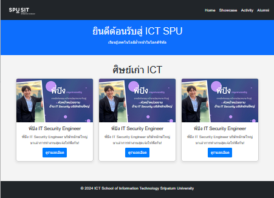

🌐 ICT Department Website @ SPU

เว็บไซต์นี้จัดทำขึ้นเพื่อเผยแพร่ข้อมูลเกี่ยวกับ สาขาวิชาเทคโนโลยีสารสนเทศและการสื่อสาร (ICT) มหาวิทยาลัยศรีปทุม (Sripatum University)
เนื้อหาภายในครอบคลุมข้อมูลของหลักสูตร รายวิชา จุดเด่น ผลลัพธ์การเรียนรู้ (PLO) และแนวทางอาชีพของนักศึกษา

📸 Website Preview

🔍 Features

    ข้อมูลหลักสูตรแบบครบถ้วน

    แสดงผลแบบ Responsive ใช้งานได้ทั้งบนมือถือและเดสก์ท็อป

    ดีไซน์เรียบง่าย สบายตา ใช้งานง่าย

    เข้าถึงข้อมูลรายวิชาและกลุ่มโมดูลได้อย่างชัดเจน

🚀 Deployment

เว็บไซต์นี้ถูก Deploy ด้วย GitHub Pages
สามารถเข้าชมได้ที่:
🔗 https://thepoppy.github.io/ICTDeptSPU.github.io/
📌 License

This project is licensed under the MIT License.
